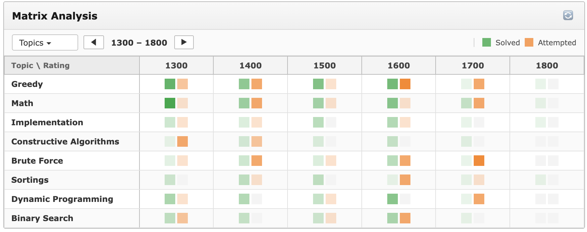

# Codeforces Matrix Analyzer 🚀

A polished, native-looking Google Chrome extension designed to seamlessly inject a powerful training matrix directly into Codeforces user profile pages. Analyze yours or any competitor's strengths and target areas at a single glance with an automated, relative-density skill heatmap.



---

## ✨ Features

- **🔄 Automatic Dynamic Injection:** No extra buttons or navigation tabs needed. The matrix inserts itself cleanly into the main page body right below the profile summary or user activity calendar.
- **📊 Optimized Column Constraints:** Columns are locked to a strict 6-rating band window to prevent horizontal layout breaks, while topic rows allow for infinite vertical scrolling.
- **🎨 Native Codeforces Aesthetic:** Meticulously designed with Codeforces' custom typography (`13px Verdana`), standard light borders, and signature brand colors (`rgba` greens and oranges) to feel like a first-party feature.
- **⚖️ Relative-Density Heatmap Engine:** Cell opacities are dynamically calculated using a relative local maximum formula based only on the current visible grid viewport.
- **💾 Permanent Filter Memory:** Fully persistent states utilizing `chrome.storage.local`. Customized grids stay saved across tab closures and complete browser restarts.
- **🔘 Interactive Problem Popups:** Clickable, sharp grid squares effortlessly toggle scroll-locked, custom dropdown overlays full of direct problem links without layout shifting. 
- **👻 Inactive & Ghost-State Fallbacks:** Clean, unclickable flat grey blocks map out empty slots. Completely empty profiles initialize a sandbox baseline populated with the top 8 standard problem tags.

---

## 🛠️ Free Local Installation (Developer Mode)

Because this extension is self-contained, you do not need to pay a registration fee or download it from the Chrome Web Store. You can load it directly from your machine for free:

1. **Download/Clone** this repository to your local computer.
2. Open Google Chrome and navigate to `chrome://extensions/` in the URL bar.
3. Toggle the **Developer Mode** switch in the top-right corner to **ON**.
4. Click the **Load unpacked** button in the top-left corner.
5. Select the local directory folder containing the repository files (ensuring `manifest.json`, `content.js`, and `styles.css` are in the root).
6. Navigate to any Codeforces profile page (e.g., `https://codeforces.com/profile/tourist`) to see the analyzer in action!

---

## 📁 Repository Structure

```text
cf-extension/
├── manifest.json   # Manifest V3 Extension configurations & permissions
├── content.js       # Core logic engine, DOM parsing, and API handling
├── styles.css      # Pure semantic styling & custom layout configurations
├── icon16.png      # Extension Favicon asset (16x16px)
├── icon48.png      # Extension Dashboard asset (48x48px)
└── icon128.png     # Extension Pop-up installation asset (128x128px)